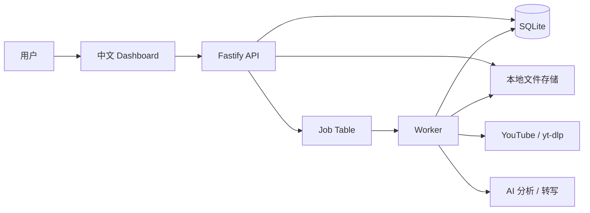
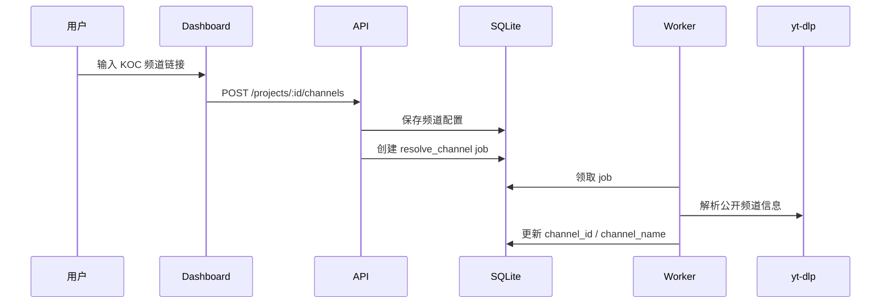

# KOC YouTube Product Feedback Dashboard Architecture

## 1. Architecture Goal

本架构服务于已确认的 Dashboard PRD：用户创建产品项目，添加公开 YouTube KOC 频道，系统按自动或手动方式抓取视频，获取字幕或音频转写，提炼正面/中性/负面反馈，并生成项目级中文报告。

第一版架构目标：

- 能快速做出可演示 MVP。
- 模块边界清晰，适合作为 Vibe Coding 分享案例。
- 支持后台长任务，避免把 YouTube 抓取、转写、AI 分析阻塞在前端请求里。
- 所有结论必须能回溯到原始片段、中文翻译、时间戳和视频来源。
- Dashboard 界面和业务文案默认中文。

## 2. Recommended Stack

### 2.1 Application Stack

- Frontend：React + Vite + TypeScript
- UI：Tailwind CSS + shadcn/ui style components + lucide-react icons
- Backend API：Node.js + Fastify + TypeScript
- Worker：Node.js worker process
- Database：SQLite for MVP
- ORM / Migration：Prisma
- Job Scheduling：database-backed jobs + worker polling + lightweight cron
- YouTube extraction：`yt-dlp` CLI
- Audio processing：`ffmpeg`
- AI：LLM API for analysis/reporting, audio transcription API for no-subtitle videos

### 2.2 Why This Stack

- React + Vite 适合快速做中文 Dashboard，不被全栈框架的后台任务限制拖慢。
- Fastify API 和 worker 分离，长任务更稳定。
- SQLite + Prisma 足够支撑 MVP，也方便演示数据模型。
- 用数据库 job table 替代 Redis 队列，减少部署和本地启动复杂度。
- `yt-dlp` 覆盖频道信息、视频列表、字幕和音频下载，适合作为第一版抓取能力。

## 3. High-Level System



MVP 采用一个仓库、三个运行单元：

- `web`：前端 Dashboard。
- `api`：后端 REST API。
- `worker`：后台抓取、转写、分析、报告生成任务。

## 4. Module Boundaries

### 4.1 Frontend Modules

中文页面结构：

- 项目列表
- 项目概览
- KOC 频道管理
- 视频列表
- 视频分析详情

关键前端职责：

- 创建项目，维护产品名称、关键词和产品背景。
- 添加 KOC YouTube 频道链接。
- 配置自动抓取开关和周期。
- 触发手动抓取。
- 展示视频分析状态。
- 展示正面/中性/负面反馈和证据片段。
- 在项目概览页复制项目级报告。

### 4.2 Backend API Modules

- Project API：项目 CRUD、关键词管理。
- KOC Channel API：频道添加、抓取设置、频道状态。
- Video API：视频列表、视频详情、分析状态。
- Feedback API：反馈项、证据片段查询。
- Report API：项目级报告读取、重新生成、复制文本。
- Job API：触发手动抓取、查询任务状态。

### 4.3 Worker Modules

- Scheduler：扫描需要自动抓取的 KOC 频道。
- Channel Resolver：解析公开 YouTube 频道基础信息。
- YouTube Collector：解析频道、获取公开视频列表、抓取最近视频。
- Transcript Loader：优先获取 YouTube 字幕。
- Audio Transcriber：无字幕时下载音频并转写。
- Segmenter：按时间片段切分字幕或转写文本。
- Relevance Analyzer：筛选产品相关片段。
- Feedback Extractor：提炼正面/中性/负面反馈和重要性。
- Report Generator：汇总项目下所有已分析结果，生成项目级报告。

## 5. Data Model

### 5.1 Core Tables

```text
projects
- id
- product_name
- product_context
- created_at
- updated_at

project_keywords
- id
- project_id
- keyword
- source              -- user | default
- created_at

koc_channels
- id
- project_id
- channel_url
- channel_id
- channel_name
- koc_name
- metadata_status     -- pending | processing | done | failed
- metadata_error
- auto_fetch_enabled
- fetch_frequency     -- daily | every_2_days | weekly
- last_fetched_at
- next_fetch_at
- last_fetch_status
- last_fetch_error
- notes
- created_at
- updated_at

videos
- id
- project_id
- koc_channel_id
- youtube_url
- youtube_video_id
- title
- channel_name
- koc_name
- published_at
- duration_seconds
- transcript_status   -- pending | processing | done | failed
- transcript_source   -- youtube_caption | audio_transcription
- transcript_failure_reason
- analysis_status     -- pending | processing | done | failed
- analysis_failure_reason
- created_at
- updated_at

transcript_segments
- id
- video_id
- start_time_seconds
- end_time_seconds
- text
- source_language
- text_zh
- source_type         -- youtube_caption | audio_transcription
- is_product_related
- relevance_reason
- created_at

feedback_items
- id
- project_id
- video_id
- polarity            -- positive | neutral | negative
- importance          -- high | medium | low
- summary
- suggestion
- speaker_type        -- koc_self | audience_or_community | unclear
- confidence
- created_at

feedback_evidence
- id
- feedback_item_id
- transcript_segment_id
- created_at

product_reports
- id
- project_id
- report_scope        -- project
- report_text
- generated_at
- version
```

### 5.2 Job Tables

```text
jobs
- id
- type                -- resolve_channel | sync_channel | analyze_video | generate_project_report
- status              -- pending | processing | done | failed
- priority
- payload_json
- error_message
- run_after
- started_at
- finished_at
- created_at
- updated_at

fetch_runs
- id
- koc_channel_id
- trigger_type        -- auto | manual
- status              -- processing | done | failed
- videos_found
- videos_enqueued
- error_message
- started_at
- finished_at
```

## 6. Processing Flows

### 6.1 Add KOC Channel



添加频道后只解析频道基础信息，不强制立即抓视频或分析。是否分析取决于自动周期或用户手动触发。

### 6.2 Manual Fetch

手动抓取在自动抓取开启或关闭时都可用。

```text
用户点击手动抓取
-> API 创建 sync_channel job，trigger_type = manual
-> Worker 获取该频道最近 1 条公开视频
-> 如果视频未分析，写入 videos
-> 创建 analyze_video job
-> 分析完成后创建 generate_project_report job
```

### 6.3 Auto Fetch

```text
Worker 定时扫描 koc_channels
-> 找到 auto_fetch_enabled = true 且 next_fetch_at <= now 的频道
-> 创建 sync_channel job，trigger_type = auto
-> 只抓取 last_fetched_at 之后新发布的视频
-> 为新视频创建 analyze_video job
-> 更新 last_fetched_at 和 next_fetch_at
-> 分析完成后创建 generate_project_report job
```

### 6.4 Video Analysis

```text
analyze_video job
-> 获取 YouTube 字幕
-> 如果没有字幕，下载音频并转写
-> 保存 transcript_segments，包含原文和中文翻译
-> 用产品名称、用户关键词、默认关键词筛选相关片段
-> 提炼 feedback_items
-> 绑定 feedback_evidence
-> 更新 video.analysis_status = done
-> 创建 generate_project_report job
```

### 6.5 Project Report Generation

```text
generate_project_report job
-> 读取项目下所有 done 视频
-> 读取 feedback_items 和 evidence
-> 聚合正面反馈、中性观察、负面反馈/风险
-> 统计高频问题 / 高频观点涉及的 KOC 数和视频数
-> 生成产品可考虑建议，并标注来源类型
-> 输出项目级中文报告
-> 保存 product_reports
```

## 7. API Draft

### 7.1 Projects

```text
GET    /api/projects
POST   /api/projects
GET    /api/projects/:projectId
PATCH  /api/projects/:projectId
```

### 7.2 KOC Channels

```text
GET    /api/projects/:projectId/channels
POST   /api/projects/:projectId/channels
PATCH  /api/channels/:channelId
POST   /api/channels/:channelId/fetch
```

### 7.3 Videos

```text
GET    /api/projects/:projectId/videos
GET    /api/videos/:videoId
POST   /api/videos/:videoId/retry-analysis
```

### 7.4 Feedback And Evidence

```text
GET    /api/videos/:videoId/feedback
GET    /api/feedback/:feedbackId/evidence
```

### 7.5 Reports

```text
GET    /api/projects/:projectId/report
POST   /api/projects/:projectId/report/regenerate
```

### 7.6 Jobs

```text
GET    /api/jobs/:jobId
GET    /api/projects/:projectId/jobs
```

## 8. AI Analysis Design

### 8.1 Relevance Analyzer Output

Each segment should return:

```json
{
  "is_product_related": true,
  "relevance_reason": "提到了产品关键词或和产品体验直接相关",
  "confidence": 0.86
}
```

### 8.2 Feedback Extractor Output

Feedback extraction should be evidence-first:

```json
{
  "polarity": "negative",
  "importance": "high",
  "summary": "KOC 认为战斗过程中存在明显卡顿，影响操作体验。",
  "suggestion": "优先排查战斗场景帧率和卡顿问题。",
  "speaker_type": "koc_self",
  "confidence": 0.91,
  "evidence_segment_ids": ["seg_123", "seg_124"]
}
```

### 8.3 Report Generator Rules

项目级报告必须满足：

- 默认中文。
- 汇总当前项目下所有已分析 KOC 和视频。
- 正面反馈、中性观察、负面反馈/风险并列呈现。
- 高频观点体现涉及 KOC 数量和视频数量。
- 证据索引包含 KOC、视频、时间戳、原始片段、中文翻译。
- 产品建议标注来源类型：
  - KOC 明确建议
  - 基于反馈推导
  - 需要更多样本验证

## 9. Status And Error Handling

### 9.1 Video Status

```text
transcript_status:
- pending
- processing
- done
- failed

analysis_status:
- pending
- processing
- done
- failed
```

### 9.2 Job Retry

- YouTube 频道解析失败：允许用户修改链接后重试。
- 字幕获取失败：自动进入音频转写。
- 音频转写失败：记录失败原因，允许手动重试。
- AI 分析失败：记录失败原因，允许重试 analyze_video job。
- 报告生成失败：保留上一个可用报告，并允许重新生成。

### 9.3 Idempotency

- `videos.youtube_video_id` 在同一项目下应唯一。
- 自动抓取只处理 `published_at > last_fetched_at` 的新视频。
- 手动抓取最近 1 条视频时，如视频已存在，不重复写入，只允许重新分析。
- 同一个 `sync_channel` job 失败不应影响已有分析结果。

## 10. Local Development Shape

建议目录：

```text
.
├── docs/
│   ├── prd-dashboard.md
│   └── architecture-dashboard.md
├── apps/
│   ├── web/
│   ├── api/
│   └── worker/
├── packages/
│   ├── db/
│   ├── shared/
│   └── ai/
├── prisma/
│   └── schema.prisma
└── storage/
    ├── audio/
    ├── transcripts/
    └── logs/
```

第一版可以在一个 `npm run dev` 脚本中同时启动 web、api、worker。

## 11. Implementation Phases

### Phase 1: Scaffold

- 初始化 TypeScript monorepo。
- 建立 React Dashboard、Fastify API、worker。
- 建立 Prisma + SQLite。
- 创建基础页面骨架和中文导航。

### Phase 2: Project And Channel CRUD

- 项目创建和列表。
- 默认关键词初始化和用户增删：`bug`、`lag`、`crash`、`fps`、`loading`、`freeze`、`stutter`、`paywall`、`gacha`、`grind`。
- KOC 频道添加、抓取配置、状态展示。

### Phase 3: YouTube Collection

- 通过 `yt-dlp` 解析公开频道。
- 获取最近公开视频。
- 手动抓取最近 1 条。
- 自动抓取周期调度。

### Phase 4: Transcript And Transcription

- 优先读取 YouTube 字幕。
- 无字幕时下载音频并转写。
- 保存时间片段、原文、中文翻译、来源类型。

### Phase 5: AI Analysis

- 产品相关片段识别。
- 正面/中性/负面反馈提炼。
- 重要性判断。
- 证据绑定。

### Phase 6: Project Report

- 项目级报告聚合。
- 高频观点统计。
- 产品建议来源标注。
- 一键复制。

### Phase 7: Demo Polish

- 状态、错误、重试体验。
- 示例数据。
- Vibe Coding 分享材料可引用的架构图和流程图。

## 12. Main Risks

- YouTube 抓取可能受网络、地区、频道结构变化影响。
- 长视频音频转写成本和耗时可能较高。
- AI 可能误判游戏实况为产品评价，需要强制证据绑定和低置信度标记。
- 自动抓取需要避免重复分析同一视频。
- 项目级报告需要控制长度，否则复制给产品团队时可读性会下降。

## 13. Architecture Decision Summary

- MVP 采用单仓库、多运行单元：web、api、worker。
- 数据库用 SQLite，后台任务用数据库 job table。
- YouTube 内容采集由 worker 负责，不在 API 请求里同步执行。
- 最终报告是项目级，不是视频级。
- Dashboard 和报告默认中文。
- 证据必须同时包含原始片段和中文翻译。
